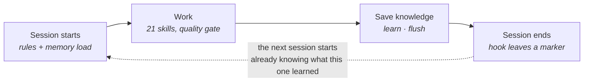
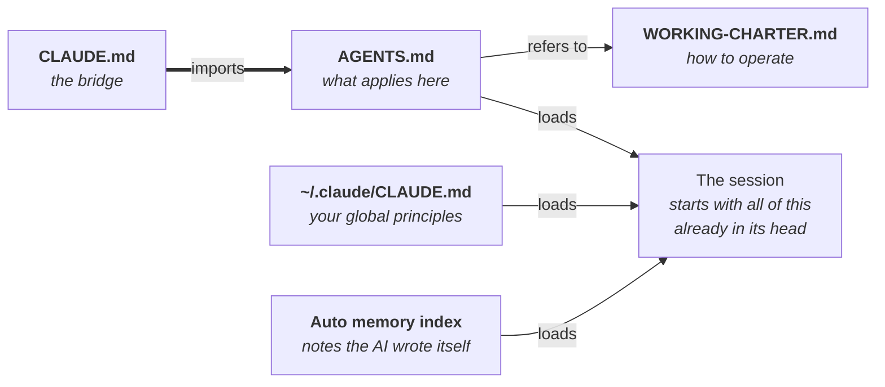
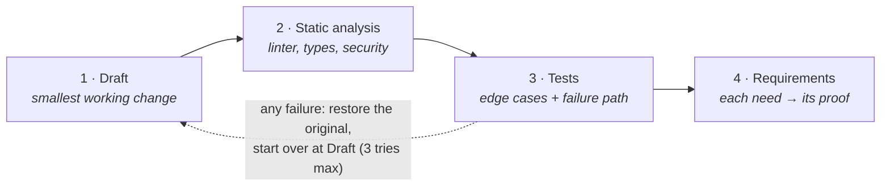
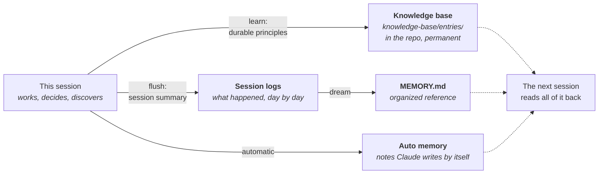

# System Overview — Every Session Smarter

A plain-language map of the AI development system in this repository: every part,
what it is for, how it behaves, and the one idea that connects it all.

---

## The idea: knowledge should not evaporate

Normally, every AI session starts from zero. You explain your project, your rules,
your past decisions — and when the session ends, all of it is gone. Next time, you
explain again.

This system fixes that with three moves:

1. **Rules load automatically.** The AI starts every session already knowing how to
   behave and what this project is.
2. **Knowledge gets written down.** Decisions, lessons, and workflows are saved as
   files, so the next session can read them.
3. **A robot checks everything.** An automatic validator makes sure the whole system
   stays true — nothing documented that doesn't exist, nothing existing that isn't
   documented.

One rule holds it together: **every rule lives in exactly one place**, and every
other document points to it. Two copies of the same rule always drift apart — so
there are never two copies.

---

## Flow 1 — The session loop

A session is a loop. It opens with automatic context, work happens through skills,
knowledge is saved, and the session closes — leaving the next session with more to
start from than this one had.

---

## Flow 2 — The rules chain: how the AI knows how to behave

The AI's personality and rules are three files that load in a chain at the start of
every session. The first arrow in this chain is the most important line in the
repository: Claude Code only reads a file called `CLAUDE.md`, so without that little
bridge file, none of the rules would load at all. (For months, it was missing — and
nobody could tell. An automatic check now guards it forever.)

The division of labor is simple: **the charter says *how* to work** (think before
acting, speak plainly, ask only when it matters, check every skill before trusting
it), and **`AGENTS.md` says *what applies here*** (this project's conventions, the
skill catalog, the memory layout). Where they overlap, the charter wins.

---

## Flow 3 — The quality gate: how code changes are protected

The charter includes a "code module" that sleeps until a real code change happens —
a feature, a bug fix, a refactor. Then it wakes and forces every change through four
stages, in order, no stage skipped. If any stage fails, the work is thrown away, the
original state is restored, and the whole gate runs again from the top. Three tries
maximum — after that, the AI stops and writes a diagnosis instead of forcing it.

There is a second gate, outside the AI entirely: **the main branch only changes
through a pull request that the owner merges**. The AI proposes; the human decides.

---

## The workers: 21 skills

A skill is a written procedure the AI follows instead of improvising — like a
checklist an experienced engineer would use. Each triggers when you type its command
or just describe what you want. Before relying on any skill, the AI runs the
charter's **skill checker**: does it fit this task, does it work on our real input,
does it stay inside the project's boundaries? A skill that fails gets dropped, with
one line of explanation.

### Decide — choosing what to build, and with what

| Skill | Goal | Behavior |
|-------|------|----------|
| `/decide` | A researched, debated, recorded decision | Criteria before options, live research before recommending, five personas argue, and the choice lands in `decisions/` with a revisit trigger |
| `/product-brief` | Know if an idea is worth building | Market research, viability debate, an explicit Go / No-go / Pivot verdict — the spec is only written on Go |

### Build — from vague idea to working code

| Skill | Goal | Behavior |
|-------|------|----------|
| `/requirements` | Turn a vague idea into a precise spec | Digs for the real problem first — users describe solutions, not problems |
| `/architecture` | Design the system | Extracts requirements, weighs trade-offs, prefers the simplest design that works, then runs its critic checklist |
| `/code-generation` | Production-ready code, not just "it runs" | Interface first, then happy path, edge cases, errors, tests — then the critic |
| `/testing` | Tests that catch real bugs | Picks the right test type; covers happy path, edge cases, and the failure path |
| `/debug` | Find the root cause, not the symptom | Reproduce → hypothesis → one change at a time → regression test that fails before the fix |
| `/refactor` | Improve code without changing behavior | Tests first as a safety net, then small verified steps |

### Ship — getting work reviewed and released

| Skill | Goal | Behavior |
|-------|------|----------|
| `/commit` | Clean, meaningful commits | Inspects the diff, writes a conventional message where the body explains *why* |
| `/pr` | A reviewable proposal | Pushes the branch, writes a structured description of what changed and why |
| `/code-review` | Catch problems before merge | Six dimensions in priority order; findings rated blocker / important / suggestion — and calls out what's done well |
| `/security-review` | Find exploitable weaknesses | OWASP-based audit; flags only what it is confident about, rated by severity |
| `/deploy` | Ship safely | Pre-flight checklist, a known rollback plan before anything moves, verification after |
| `/git-steward` | Git handled automatically | Names a new project, creates its GitHub repo, then commits at verified milestones and pushes — destructive acts always ask first |
| `/deploy-steward` | Every milestone runs deployed | Provisions Railway at bootstrap, then deploys each milestone to staging and health-checks it — "works on my machine" is not done |

### Remember — the memory system, where "smarter" comes from

| Skill | Goal | Behavior |
|-------|------|----------|
| `/learn` | Keep a lesson forever | Extracts the reusable rule (not just what happened) and saves it with its reason and tags |
| `/flush` | Save the session before it's lost | Writes a structured summary — goal, decisions with reasons, open threads — to the session log |
| `/dream` | Turn piled-up logs into organized knowledge | Merges, removes duplicates, flags contradictions — never deletes sources, only archives them |
| `/standup` | A clear progress report | Done / in progress / next / notes — specific and verifiable, never "worked on X" |

### Evolve — the system improving itself

| Skill | Goal | Behavior |
|-------|------|----------|
| `/skillify` | Turn a workflow that worked into a new skill | Checks it's worth keeping, writes the procedure *including what went wrong*, adds it to the catalog |
| `/reconcile-docs` | One home per rule | Finds every restatement, picks the authoritative home, turns the rest into references — then sweeps again, because drift always hides in more places than the first search finds |

---

## The automation: three hooks that run by themselves

A hook is a small script the system runs automatically at fixed moments — no one
has to remember anything.

| Hook | When it runs | What it does |
|------|-------------|--------------|
| **Session start** | The moment a session opens | Runs the validator and shows the repo's health, then points at the last session log so open threads get picked up. In a project without these tools, it stays silent |
| **Before compaction** | Just before the AI compresses its conversation history | Reminds it to run `/flush` first — so nothing important is lost in the compression |
| **Session end** | The session closes | Leaves a timestamped marker that the next session's start hook reads back |

---

## Flow 4 — Memory: where knowledge actually lives

> **One honest caveat:** when the AI runs in a temporary cloud computer, its local
> memory folder dies with the machine. That is why the most important knowledge goes
> into the repository itself — the knowledge base, the documents, the commit
> messages. The repo is the memory that cannot be lost.

---

## The guard: a robot that keeps the system honest

The most dangerous failures here are *silent* ones: a skill with a broken header
simply never loads, a hook without registration simply never runs, and nothing tells
you. So one small program — `tools/validate.py` — checks the whole system, and an
automatic pipeline runs it on every proposed change. Nothing reaches the main branch
while any check fails.

It checks: no empty documents · every link goes somewhere real · every anchor
exists · every skill's header parses · every skill is in every catalog · stated
counts match reality · settings files parse · the `CLAUDE.md` bridge exists · hooks
are executable and valid.

The list itself has a story: several checks exist because that exact failure
happened once and was caught by hand. The system's rule is that **a problem found
twice by a human becomes a check run forever by the machine**.

---

## Who does what

| Role | Responsibility |
|------|----------------|
| **You (the owner)** | Decide. Every change reaches the main branch only through a pull request you merge. Judgment calls — what to delete, what to rewrite — are always yours |
| **The AI** | Works by the charter: thinks before acting, verifies before claiming, asks at most one question at a time, escalates instead of proceeding on anything destructive |
| **The 21 skills** | Written procedures for repeatable work — each checked for fit before it is trusted |
| **The 3 hooks** | Run automatically at session start, before compaction, and at session end — the part of the memory system that needs no one to remember it |
| **The validator + CI** | Check every proposed change against nine rules and block anything broken from reaching the main branch |
| **The knowledge base** | The permanent lessons — including the lessons learned while building this very system |

---

## Why it is built this way

Every piece follows from one demand: **everything documented must actually run, and
everything that runs must be documented.** When this system was first examined, half
of it was beautiful intention — hooks nothing executed, commands that didn't exist,
a rules file the AI never read. Rebuilding it meant testing every claim against the
real product, wiring what was dead, deleting what was fiction, and then installing
the validator so the gap between story and reality can never quietly open again.

The result is a system that practices what it preaches — and that used its own tools
to build itself: its lessons were saved with `/learn`, its sessions logged with
`/flush`, its newest skill created by `/skillify` from the very workflow that fixed
it.
